# BarberQueue Screen Navigation Diagram

This diagram is based on the current Next.js App Router screens, shared navigation components, and role redirects in the system.

```mermaid
flowchart TD
  Visitor([Visitor])
  Landing["Public Landing<br/>/"]
  ServicesAnchor["Services Section<br/>/#services"]
  AiAnchor["AI Style Section<br/>/#ai-style"]

  AuthLogin["Login<br/>/auth/login"]
  AuthRegister["Register<br/>/auth/register"]
  AuthCheckEmail["Check Email<br/>/auth/check-email"]
  AuthForgot["Forgot Password<br/>/auth/forgot-password"]
  AuthUpdate["Update Password<br/>/auth/update-password"]
  AuthCallback["Auth Callback<br/>/auth/callback"]
  AuthConfirm["Email Confirm<br/>/auth/confirm"]
  AuthError["Auth Code Error<br/>/auth/auth-code-error"]
  SignOut["Sign Out<br/>/auth/signout"]

  RoleDecision{"Authenticated role?"}
  ProtectedUser["Protected Customer URL<br/>/user/*"]
  ProtectedAdmin["Protected Admin URL<br/>/admin/*"]

  UserRoot["User Root<br/>/user"]
  UserDashboard["Customer Dashboard<br/>/user/dashboard"]
  UserJoinDialog["Join Queue Dialog<br/>general or specific barber"]
  UserStyleDialog["Style AI Dialog<br/>photo upload/camera"]
  UserBarberDialog["Barber Lineup Dialog<br/>join selected barber queue"]
  UserMyQueue["My Queue<br/>/user/my-queue"]
  UserTicketDialog["Ticket Details Dialog"]
  UserBarbers["Barbers<br/>/user/barbers"]
  UserServices["Services<br/>/user/services"]

  AdminRoot["Admin Root<br/>/admin"]
  AdminDashboard["Admin Dashboard Hub<br/>/admin/dashboard"]
  AdminCallNext["Call Next Customer Dialog"]
  AdminRemove["Remove Customer Dialog"]
  AdminLogs["Customer & Barber Logs<br/>/admin/logs"]
  AdminProfiles["Barber Staff Profiles<br/>/admin/profiles"]
  AdminProfilesDialog["Register/Edit/Delete Barber Dialogs"]
  AdminServices["Manage Services<br/>/admin/services"]
  AdminServicesDialog["Add/Edit Service Dialog"]
  AdminSettings["System Settings<br/>/admin/settings"]

  Visitor --> Landing
  Landing --> ServicesAnchor
  Landing --> AiAnchor
  Landing -- "Join Queue CTA" --> AuthLogin

  AuthLogin -- "Create account" --> AuthRegister
  AuthRegister -- "Successful registration" --> AuthCheckEmail
  AuthCheckEmail -- "Already confirmed / back to app" --> AuthLogin
  AuthLogin -- "Forgot password" --> AuthForgot
  AuthForgot -- "Reset email link" --> AuthUpdate
  AuthCallback --> RoleDecision
  AuthConfirm --> RoleDecision
  AuthCallback -- "Invalid or expired code" --> AuthError
  AuthConfirm -- "Invalid or expired code" --> AuthError
  AuthError --> AuthLogin

  AuthLogin -- "Successful login" --> RoleDecision
  Landing -- "Already signed in" --> RoleDecision
  RoleDecision -- "customer" --> UserDashboard
  RoleDecision -- "receptionist" --> AdminDashboard

  UserRoot --> UserDashboard
  UserDashboard --> UserJoinDialog
  UserDashboard --> UserStyleDialog
  UserDashboard --> UserBarberDialog
  UserDashboard --> UserMyQueue
  UserDashboard --> UserBarbers
  UserDashboard --> UserServices
  UserMyQueue --> UserTicketDialog
  UserMyQueue -- "No active ticket" --> UserDashboard
  UserBarbers -- "Back to dashboard" --> UserDashboard

  AdminRoot --> AdminDashboard
  AdminDashboard --> AdminCallNext
  AdminDashboard --> AdminRemove
  AdminDashboard --> AdminLogs
  AdminDashboard --> AdminProfiles
  AdminDashboard --> AdminServices
  AdminDashboard --> AdminSettings
  AdminProfiles --> AdminProfilesDialog
  AdminServices --> AdminServicesDialog

  UserDashboard -- "Sign out" --> SignOut
  UserMyQueue -- "Sign out" --> SignOut
  UserBarbers -- "Sign out" --> SignOut
  UserServices -- "Sign out" --> SignOut
  AdminDashboard -- "Sign out" --> SignOut
  AdminLogs -- "Sign out" --> SignOut
  AdminProfiles -- "Sign out" --> SignOut
  AdminServices -- "Sign out" --> SignOut
  AdminSettings -- "Sign out" --> SignOut
  SignOut --> Landing

  ProtectedUser -.->|"not signed in"| AuthLogin
  ProtectedAdmin -.->|"not signed in"| AuthLogin
  ProtectedUser -.->|"signed in as receptionist"| AdminDashboard
  ProtectedAdmin -.->|"signed in as customer"| UserDashboard
  Landing -.->|"signed in visitor"| RoleDecision
```

## Route Legend

| Area | Screen | Route | Purpose |
|---|---|---|---|
| Public | Landing | `/` | Public shop landing page with live queue status, services, and queue CTA. |
| Auth | Login | `/auth/login` | Primary sign-in screen and role-based redirect after login. |
| Auth | Register | `/auth/register` | Customer account creation. |
| Auth | Check Email | `/auth/check-email` | Email confirmation reminder and resend flow. |
| Auth | Forgot Password | `/auth/forgot-password` | Password reset request. |
| Auth | Update Password | `/auth/update-password` | New password form after reset link. |
| Customer | Dashboard | `/user/dashboard` | Main customer home: join queue, view active spot, Style AI, barber roster. |
| Customer | My Queue | `/user/my-queue` | Active ticket tracking and visit history. |
| Customer | Barbers | `/user/barbers` | Barber roster/status screen. |
| Customer | Services | `/user/services` | Available services for customers. |
| Admin | Dashboard Hub | `/admin/dashboard` | Live queue operations: open/close shop, call next, complete/remove tickets. |
| Admin | Logs | `/admin/logs` | Customer and barber activity logs. |
| Admin | Profiles | `/admin/profiles` | Barber staff management. |
| Admin | Services | `/admin/services` | Service catalog management. |
| Admin | Settings | `/admin/settings` | System-level settings. |

## Access Rules

- Unauthenticated users who try to open `/user/*` or `/admin/*` are sent to `/auth/login`.
- Signed-in customers are sent to `/user/dashboard`.
- Signed-in receptionists are sent to `/admin/dashboard`.
- Receptionists are redirected away from `/user/*` to `/admin/dashboard`.
- Customers are redirected away from `/admin/*` to `/user/dashboard`.
- Signing out returns the user to `/`.
